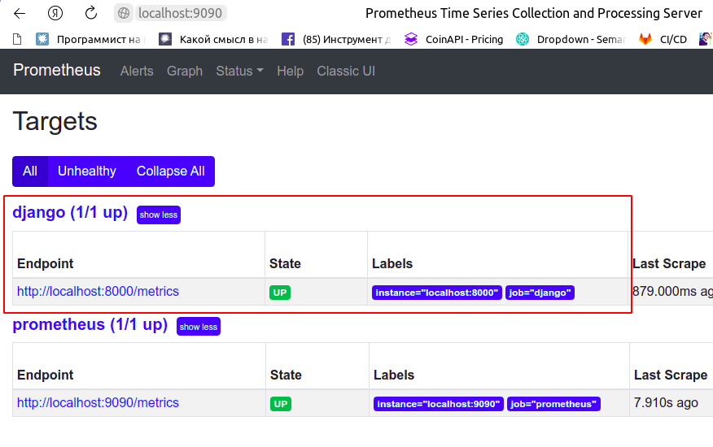
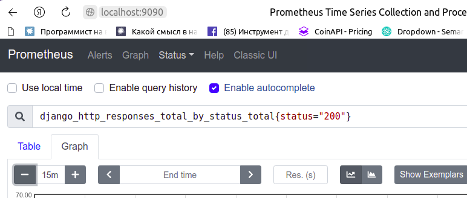
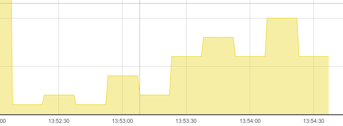

# Сравнение сбора метрик в обычном и мультипроцессном режиме

## Обычный режим

1. В конфигах Prometheus пропишите target `localhost:8000`.

2. Запустите сервис django:

`gunicorn -w 4 --log-level DEBUG djangomultiprocess.wsgi`

А также файл requester.py, который будет выполнять запросы на django-сервис:

`python requester.py`

3. Запустите воркер Prometheus. Убедитесь, что Prometheus собирает метрики
с django-сервиса:
   

4. Перейдите на вкладку Graph в Prometheus и отобразите метрику:

`django_http_responses_total_by_status_total{status="200"}`

Тип этой метрики - Counter, которая должна монотонно возрастать.

5. Убедитесь, что значения метрики скачут плюс-минус:

Это говорит о том, что метрики отдаются из разных процессов.

## Мультипроцессный режим

1. Остановите django-сервис.
2. В файле settings.py раскомментируйте строку:

`multiprocess.MultiProcessCollector(REGISTRY)`

3. Экспортируйте переменную окружения `prometheus_multiproc_dir`:

`export prometheus_multiproc_dir=metrics`

4. Перезапустите django-сервис и requester.py
5. Вернитесь в Prometheus.
6. Убедитесь, что значения метрики `django_http_responses_total_by_status_total` монотонно возрастают.
